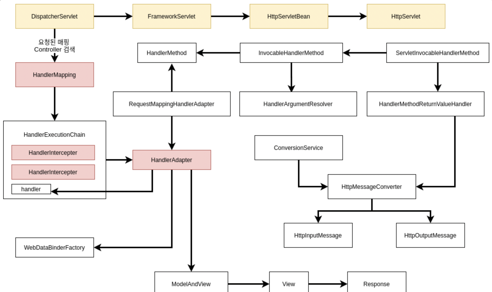

# Spring MVC

- 스프링 MVC 설정 방법만 익혀두면 웹 개발에 필요한 다양한 기능을 구현할 수 있게 된다.
- DisptacherServlet은 초기화 과정에서 contextConfiguration 초기화 파라미터에 지정한 설정 파일을 이용해서 스프링 컨테이너를 초기화 한다.
  - contextConfiguration의 설정 파일이 AnnotationConfigWebApplicationContext이다.
    - annotation기반 스프링 mvc를 사용하겠다는 의미이다.
- 스프링 MVC 프레임워크에서 컨트롤러란
  - 웹 요청을 처리하고 그 결과를 뷰에 전달하는 스프링 빈 객체

### 스프링 MVC 설정에 대해 조금 더 알아보기


# Spring MVC 동작 방식




### Dispatcher Servlet

- DispatcherServlet은 요청이 들어오면
  - HandlerMapping 빈 객체에게 요청을 처리하기 위한 컨트롤러 검색을 요청한다.
  - HandlerAdapter에게 HandlerMapping을 통해 찾은 컨트롤러의 객체를 실행하도록 요청한다.
    - 컨트롤러가 ModelAndView를 리턴하는 객체도, 그렇지 않은 객체도 있기 때문에 핸들러의 처리 결과를 ModelAndView로 반환하는 역할을 HandlerAdapter에서 한다.
  - ViewResolver는 HandlerAdapter로 부터 ModelAndView를 응답받아 뷰를 생성하여 리턴한다.

- DispatcherServlet은 전달받은 설정 파일을 이용해서 스프링 컨테이너를 생성한다. 
- 스프링 컨테이너들에는 아래와 같은 빈들이 존재한다.
  - HandlerMapping
  - HandlerAdapter
  - ViewResolver

- DispatcherServlet은 웹 브라우저의 요청을 처리할 핸들러 객체를 찾기 위해 HandlerMapping을 사용하고 핸들러를 실행하기 위해 HandlerAdapter를 사용한다.

### WebMvcConfigurer 인터페이스와 설정

```Java
@Configuration
@EnableWebMvc
public class MvcConfig implements WebMvcConfiguerer {
	
  @Overide
  public void configureDefaultServletHandling(DefaultServletHandlerConfigurer configurer) {
    configurer.enable();
  }
}
```


- @Configure 애노테이션을 붙인 클래스 역시 컨테이너에 빈으로 등록되므로 MvcConfig 클래스는 WebMvcConfigurer 타입의 빈이 된다.

### @EnableWebMvc

- 어노테이션 기반의 SpringMvc를 구성할 때 필요한 Bean설정들을 자동으로 해준다.


### 디폴트 핸들러

- 매핑 경로가 "/"인 경우 디스패처 서블릿이 .jsp로 끝나는 요청을 제외한 모든 요청을 처리한다.
- /index.html, /css/bootstrap.css같이 확장자가 .jsp가 아닌 모든 요청을 디스패처 서블릿이 처리하게 된다.

- 그러나 @EnableWebMvc 애노테이션이 등록하는 HandlerMapping은 @Controller 애노테이션을 적용한 빈 객체가 처리할 수 있는 요청 경로만 대응 할 수 있다.

- .html .css 와 같은 요청을 처리 할 수 있는 컨트롤러 객체를 만들기 보단, WebMvcConfigurer의 configureDefaultServletHandling() 메서드를 사용하는 것이 편하다.
  - 위에 예제 코드가 있다.
- 위 설정에서는 다음의 두 Bean 객체를 추가 한다.
  - DefaultServletHttpRequestHandler
    - 클라이언트의 모든 요청을 WAS가 제공하는 디폴트 서블릿에 전달한다.
  - SimpleUrlHandlerMapping
    - 모든 경로 (/**) 를 DefaultServletHttp RequestHandler를 이용해서 처리하게 한다.

### 우선 순위

- RequestMappingHandlerMapping의 적용 우선순위가 SimpleUrlHandlerMapping의 우선순위 보다 높다.
- 웹 브라우저의 요청이 들어오면 DispatcherServlet은 아래와 같이 처리를 한다.
  1. RequestMappingHandlerMapping을 사용해서 요청을 처리할 핸들러를 검색한다.
     - 존재하면 해당 컨트롤러를 이용해서 요청을 처리한다.
  2. 존재하지 않으면 SimpleUrlHanlderMapping을 사용해서 요청을 처리할 핸들러를 검색한다.
     - /** 모든 경로에 대해 DefaultServletHttpRequestHandler를 리턴한다.
  3. DispatcherServlet은 DefaultServletHttpRequestHandler에 처리를 요청한다.
  4. DefaultServletHttpRequestHandler는 디폴트 서블릿에 처리를 위임한다.

### 정리

- 디스패처 서블릿은 웹 브라우저의 요청을 받기 위한 창구 역할을 하고, 다른 주요 구성 요소들을 이용해서 요청 흐름을 제어하는 역할을 한다.
- HandlerMapping은 클라이언트의 요청을 처리할 핸들러 객체를 찾아준다.
- 핸들러 혹은 컨트롤러 객체는 클라리언트의 요청을 실제로 처리한 뒤 뷰 정보와 모델을 설정한다.
  - 핸들러 어뎁터는 디스패처 서블릿과 핸들러 객체 사이의 변환을 알맞게 처리해 준다.
  - 컨트롤러가 ModelAndView를 리턴하지 않더라도 ModelAndView객체를 만들어 줌
- ViewResolver는 요청 처리 결과를 생성할 View를 찾아주고 최종적으로 클라이언트에 응답을 생성해서 보내준다.

